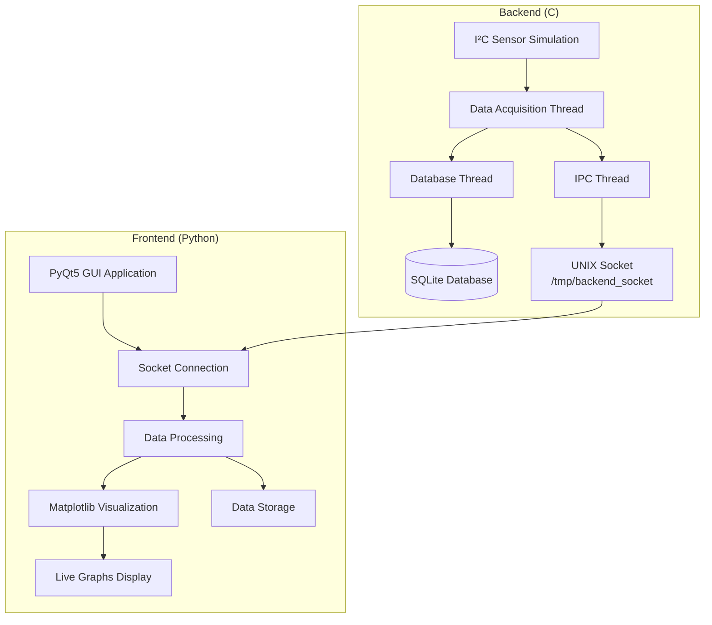
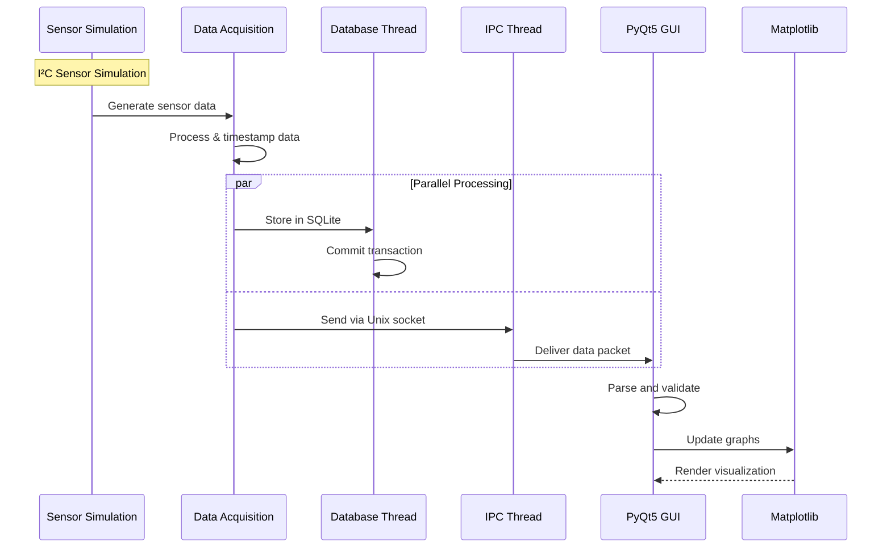

# Real-Time I²C Sensor Data Acquisition & Visualization System


[](https://en.wikipedia.org/wiki/Real-time_computing)
[](https://en.wikipedia.org/wiki/I%C2%B2C)
[](https://en.wikipedia.org/wiki/Multithreading)

##  Table of Contents
- [Overview](#-overview)
- [Architecture](#-architecture)
- [Features](#-features)
- [Prerequisites](#-prerequisites)
- [Installation](#-installation)
- [Build Process](#-build-process)
- [Running the System](#-running-the-system)
- [System Flow](#-system-flow)
- [Project Structure](#-project-structure)
- [Data Communication](#-data-communication)
- [GUI Features](#-gui-features)
- [Database Schema](#-database-schema)
- [Future Enhancements](#-future-enhancements)
- [Troubleshooting](#-troubleshooting)
- [License](#-license)

##  Overview

This project implements a **hybrid embedded data processing system** that combines:
- **C-based backend** for real-time data acquisition, multithreading, inter-process communication (IPC), and SQLite data storage.
- **Python-based GUI (PyQt5 + Matplotlib)** for real-time data visualization.

The system simulates **I²C sensor readings** (temperature and humidity), transfers data to the GUI using **UNIX domain sockets**, and visualizes live graphs in real-time.

##  Architecture



##  Features

###  **Core Features**
- **Real-time sensor data simulation** using sine/cosine patterns
- **Multithreaded backend** written in C (POSIX threads)
- **IPC via UNIX domain sockets** for efficient data exchange
- **SQLite database logging** for persistent data storage
- **PyQt5 GUI visualization** with Matplotlib integration
- **Modular architecture** - easily replace simulated sensors with real I²C hardware

###  **Data Processing**
- Continuous data acquisition at configurable intervals
- Thread-safe data handling and synchronization
- Automatic database backup and maintenance
- Error handling and recovery mechanisms

###  **Visualization**
- Real-time line graphs for temperature and humidity
- Configurable time windows (30s, 1m, 5m, 15m)
- Zoom and pan capabilities
- Export data to CSV functionality
- Responsive GUI with status indicators

##  Prerequisites

### System Requirements


- **OS**: Linux (Ubuntu/Debian recommended) or Windows Subsystem for Linux (WSL2)
- **CPU**: x86-64 or ARM64 processor
- **RAM**: 1 GB minimum (2 GB recommended)
- **Storage**: 100 MB free space

### Software Dependencies


#### C Backend Dependencies
```bash
# Ubuntu/Debian
sudo apt update
sudo apt install -y \
    build-essential \
    libsqlite3-dev \
    pkg-config \
    gcc \
    make
```

#### Python GUI Dependencies
```bash
# Ubuntu/Debian
sudo apt update
sudo apt install -y \
    python3 \
    python3-pyqt5 \
    python3-matplotlib \
    python3-pip

# Install via pip
pip install PyQt5 matplotlib
```

##  Installation

### Quick Installation Script
```bash
# Download and run installation script
wget https://raw.githubusercontent.com/yourusername/sensor-system/main/install.sh
chmod +x install.sh
sudo ./install.sh
```

### Manual Installation
```bash
# 1. Clone the repository
git clone https://github.com/yourusername/sensor-system.git
cd sensor-system

# 2. Install dependencies
./scripts/install_deps.sh

# 3. Build the project
make

# 4. Install system-wide (optional)
sudo make install
```

##  Build Process

### Backend Compilation
```bash
# Navigate to project directory
cd sensor-system

# Build the C backend
make clean    # Clean previous builds
make          # Compile with optimization
make debug    # Compile with debug symbols
```

### Build Options
```bash
# Production build (optimized)
make release

# Debug build (with symbols)
make debug

# Test build (with unit tests)
make test

# Install system-wide
sudo make install
```

##  Running the System

### Step 1: Start the Backend
```bash
# Run with default settings
./backend

# Run with custom parameters
./backend --interval 1000 --samples 1000

# Available options:
#   --interval <ms>   : Sampling interval in milliseconds
#   --samples <count> : Number of samples to collect (0=infinite)
#   --socket <path>   : Unix socket path (default: /tmp/backend_socket)
#   --db <path>       : Database file path (default: sensor_data.db)
#   --verbose         : Enable verbose logging
```

### Step 2: Start the GUI
```bash
# Method 1: Direct Python execution
python3 gui.py

# Method 2: Use provided script
./scripts/start_gui.sh

# Method 3: Run with specific socket
python3 gui.py --socket /tmp/backend_socket
```

### Step 3: Verify System Status
```bash
# Check if backend is running
ps aux | grep backend

# Check socket connection
ls -la /tmp/backend_socket

# Check database
sqlite3 sensor_data.db "SELECT COUNT(*) FROM sensor_readings;"
```

##  System Flow

### Complete Processing Pipeline


### Step-by-Step Flow

#### Phase 1: Data Generation
```
1. Sensor Simulation Startup
   └── Initialize sine/cosine wave generators
       ├── Temperature: 20-30°C sine wave
       └── Humidity: 40-60% cosine wave

2. Data Acquisition Loop
   └── Generate sample every interval
       ├── Calculate current values
       ├── Apply realistic noise (±0.5°C, ±2% RH)
       └── Timestamp with microsecond precision
```

#### Phase 2: Data Processing & Storage
```
3. Database Operations
   └── SQLite Transaction Management
       ├── Open database connection
       ├── Insert new reading
       ├── Commit transaction
       └── Close connection

4. Inter-Process Communication
   └── Unix Socket Communication
       ├── Create socket at /tmp/backend_socket
       ├── Format data: "timestamp,temp,humidity\n"
       └── Send to connected clients
```

#### Phase 3: Visualization
```
5. GUI Data Reception
   └── PyQt5 Event Loop
       ├── Connect to Unix socket
       ├── Receive data packets
       ├── Parse and validate
       └── Queue for processing

6. Real-time Plotting
   └── Matplotlib Animation
       ├── Update temperature graph
       ├── Update humidity graph
       ├── Adjust time axis
       └── Refresh display
```

##  Project Structure

```
sensor-system/
├── src/
│   ├── backend/
│   │   ├── main.c              # Main backend entry point
│   │   ├── sensor_sim.c        # I²C sensor simulation
│   │   ├── database.c          # SQLite database operations
│   │   ├── ipc_socket.c        # Unix socket communication
│   │   ├── threading.c         # POSIX thread management
│   │   └── utils.c             # Utility functions
│   └── gui/
│       ├── gui.py              # PyQt5 main window
│       ├── plot_widget.py      # Matplotlib plotting widget
│       ├── socket_client.py    # Unix socket client
│       └── data_processor.py   # Data processing logic
├── include/
│   └── backend/
│       ├── sensor_sim.h
│       ├── database.h
│       ├── ipc_socket.h
│       └── threading.h
├── scripts/
│   ├── install_deps.sh        # Dependency installer
│   ├── start_gui.sh           # GUI launcher
│   ├── start_backend.sh       # Backend launcher
│   └── test_connection.sh     # Connection tester
├── data/
│   └── sensor_data.db         # SQLite database (created at runtime)
├── docs/
│   ├── architecture.md        # System architecture
│   └── api_reference.md       # API documentation
├── tests/
│   ├── test_backend.c         # Backend unit tests
│   └── test_gui.py            # GUI unit tests
├── Makefile                   # Build configuration
├── requirements.txt           # Python dependencies
└── README.md                  # This file
```

##  Data Communication

### Unix Socket Protocol
```
Socket Path: /tmp/backend_socket
Protocol:   Stream-oriented (SOCK_STREAM)
Format:     ASCII text, newline-separated
Example:    "1634567890.123456,22.5,45.3\n"
Structure:  timestamp,temperature,humidity\n
```

### Data Packet Structure
```c
struct SensorData {
    double timestamp;      // Unix timestamp with microseconds
    float temperature;     // Temperature in °C
    float humidity;        // Humidity in % RH
};
```

### Communication Sequence
```
1. Backend creates socket
2. GUI connects to socket
3. Backend sends continuous data
4. GUI receives and parses data
5. Both sides handle errors and reconnections
```

##  GUI Features

### Main Window Layout
```
┌─────────────────────────────────────────────────────┐
│                 SENSOR DASHBOARD                    │
├─────────────────────────────────────────────────────┤
│                                                     │
│  ┌─────────────────┐  ┌─────────────────┐         │
│  │  Temperature    │  │    Humidity     │         │
│  │                 │  │                 │         │
│  │      Graph      │  │      Graph      │         │
│  │                 │  │                 │         │
│  └─────────────────┘  └─────────────────┘         │
│                                                     │
│  ┌─────────────────────────────────────────────────┐ │
│  │ Status: Connected | Samples: 1234 | Rate: 1Hz  │ │
│  └─────────────────────────────────────────────────┘ │
│                                                     │
│  [Start] [Pause] [Export CSV] [Settings] [Exit]    │
└─────────────────────────────────────────────────────┘
```

### Control Features
- **Start/Pause**: Control data flow from backend
- **Time Window**: Adjust displayed time range (30s to 15m)
- **Export Data**: Save current data to CSV format
- **Settings**: Configure connection and display options
- **Status Panel**: Real-time connection and data statistics

##  Database Schema

### Sensor Readings Table
```sql
CREATE TABLE sensor_readings (
    id INTEGER PRIMARY KEY AUTOINCREMENT,
    timestamp REAL NOT NULL,         -- Unix timestamp with microseconds
    temperature REAL NOT NULL,       -- Temperature in °C
    humidity REAL NOT NULL,          -- Humidity in % RH
    sensor_id TEXT DEFAULT 'sim1',   -- Sensor identifier
    created_at TIMESTAMP DEFAULT CURRENT_TIMESTAMP
);

-- Indexes for fast querying
CREATE INDEX idx_timestamp ON sensor_readings(timestamp);
CREATE INDEX idx_sensor_id ON sensor_readings(sensor_id);
```

### Database Operations
```bash
# Query recent readings
sqlite3 sensor_data.db "SELECT * FROM sensor_readings ORDER BY timestamp DESC LIMIT 10;"

# Calculate statistics
sqlite3 sensor_data.db "SELECT 
    AVG(temperature) as avg_temp,
    AVG(humidity) as avg_humidity,
    MIN(temperature) as min_temp,
    MAX(temperature) as max_temp
    FROM sensor_readings 
    WHERE timestamp > strftime('%s', 'now') - 3600;"
```

##  Future Enhancements

### Hardware Integration


### Planned Features
1. **Real I²C Hardware Support**
   - Interface with `/dev/i2c-*` devices
   - Support for popular sensors (BME280, SHT31, etc.)
   - Hardware abstraction layer

2. **Enhanced GUI Features**
   - Multiple plot types (bar, scatter, histogram)
   - Alarm/alert system for thresholds
   - Data export to multiple formats (JSON, Excel)
   - Remote monitoring via web interface

3. **Performance Optimizations**
   - Shared memory IPC for higher throughput
   - Zero-copy data transfer
   - Database indexing and optimization

4. **Network Connectivity**
   - MQTT integration for IoT publishing
   - REST API for remote access
   - WebSocket support for real-time web dashboard

5. **Advanced Analytics**
   - Trend analysis and prediction
   - Anomaly detection algorithms
   - Statistical reporting
   - Automated data cleanup

##  Troubleshooting

### Common Issues

**1. Socket Connection Failed**
```bash
# Check if backend is running
ps aux | grep backend

# Check socket exists
ls -la /tmp/backend_socket

# Clean stale socket
rm -f /tmp/backend_socket
```

**2. Database Errors**
```bash
# Check database permissions
ls -la sensor_data.db

# Repair corrupted database
sqlite3 sensor_data.db ".recover" | sqlite3 repaired.db

# Backup and recreate
cp sensor_data.db sensor_data.db.backup
rm sensor_data.db
```

**3. GUI Won't Start**
```bash
# Check Python dependencies
python3 -c "import PyQt5, matplotlib; print('OK')"

# Install missing packages
pip install --upgrade PyQt5 matplotlib

# Run with debug output
python3 gui.py --debug
```

**4. Compilation Errors**
```bash
# Install development libraries
sudo apt install libsqlite3-dev

# Clean and rebuild
make clean
make

# Check GCC version
gcc --version
```

### Debug Mode
```bash
# Run backend with verbose output
./backend --verbose --interval 2000

# Run GUI with debug logging
python3 gui.py --debug --socket /tmp/backend_socket

# Test socket communication
./scripts/test_connection.sh
```

##  License


This project is licensed under the MIT License - see the [LICENSE](LICENSE) file for details.

##  Contributing


We welcome contributions! Please see our [Contributing Guidelines](CONTRIBUTING.md) for details.

1. Fork the repository
2. Create a feature branch
3. Commit your changes
4. Push to the branch
5. Open a Pull Request

---

**For questions and support, please open an issue on GitHub.**  
*This project is for educational and demonstration purposes.*

---
*Developed with  for embedded systems and IoT enthusiasts.*
